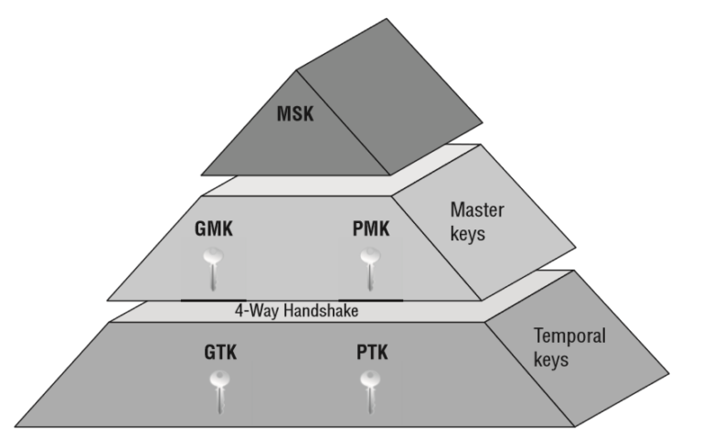

# This file explains what a Four Way Handshake is and how it works.

The four-way handshake is the process of exchanging the keys that will be used to encrypt the data between the client and the access point. It is a challenge-response handshake that is used to authenticate clients to the access point. The four-way handshake is initiated by the client, which sends a request to the access point. The access point responds with a challenge, which the client must then respond to with the correct answer.

The four-way handshake is used to establish a shared secret between the client and the access point. This shared secret is used to encrypt all subsequent communications between the client and the access point. The four-way handshake is also used to establish a shared secret between the client and the access point.

## The Four Way Handshake


## Pairwaise Transient Key (PTK)
**Pairwise Transient key** is used to encrypt all unicast traffic between a client station and the access point. PTK is unique between a client station and access point. To generate **PTK**, client device and access point need the following information.
```bash
PTK = PRF (PMK + Anonce + SNonce + Mac (AA)+ Mac (SA))
```

**Anonce** is a random number generated by an access point (authenticator), **Snonce** a random number generated by the client device (supplicant). **MAC (AA)** and **MAC (SA)** are MAC addresses of *supplicant* (client device) and MAC address of *authenticator* (access point). **PRF** is a pseudo-random function which is applied to all the input. *PTK is dependent on another high-level key PMK (pairwise master key) which is discussed below.*

## Group Temporal Key (GTK)
Group temporal key is used to encrypt all broadcast and multicast traffic between an access point and multiple client devices. GTK is the key which is shared between all client devices associated with 1 access point. For every access point, there will be a different GTK which will be shared between its associated devices. *GTK is dependent on another high-level key GMK (group master key) discussed below.*

## Pairwaise Master Key (PMK)
**PTK** is generated with the help of **PMK**. Pairwise master is key generated from master session key (**MSK**). In case of **WPA2/PSK** when device authenticates with access point the **PSK** becomes **PMK**.

## Notes:
PMK resides on all stations as in AP and client devices, so we do not need to share this information. We use this information to create PTK which are used for unicast data encryption.

## Group Master Key (GMK)
Group master key is used in a 4-way handshake to create GTK discussed above. GTK is generated on every access point and shared with the devices connected to this AP.

## Master Session Key (MSK)
The master session is the first key which is generated either from 802.1X/EAP or derived from PSK authentication.


## Structure of the keys

