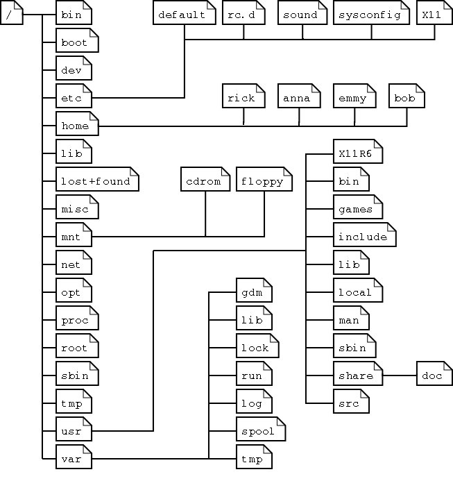

# This file explains how the Unix filesystem works

The graph below represets how the folders are structured starting from the root folder **/**

There are many ways to traverse this filesystem. Here are some helpful commands:

1. `cd <directory>` - changes current directory
2. `ls` - displays contents of the current folder
    - flag **-l** list format
    - flag **-a** list all files (including hidden)
    - flag **-h** human readable file size format
    - flag **-t** sort list by time of modification

There are many ways to display contents of a file:
1. `cat`
2. `less`
3. text editor like `nano` or `vim`
4. `tail -n <int>` - display last **int** lines of a file 
5. `head -n <int>` - display first **int** lines of a file